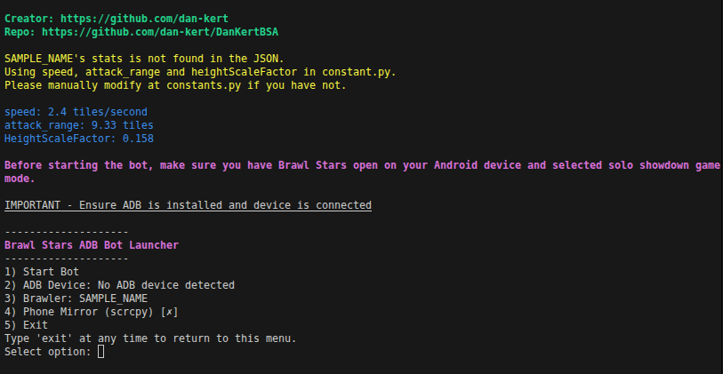

# DanKertBSA - (Brawl Stars Automation)
⚠️**DISCLAIMER**  ****this project does not guarantee the best quality or reliability of the cup set or victories****⚠️

## Info
**DanKertBSA is a bot for Brawl Stars that automates Showdown matches using ADB (Android Debug Bridge) to control physical Android devices.**



The bot spawns, finds bushes, hides, and attacks enemies automatically. It supports all platforms (Windows, Linux, macOS) and works with real Android devices.

## Bot features
- **Automated Hideout Finding**: Locates and hides in the nearest bush
- **Smart Combat**: Attacks enemies within attack range
- **Cross-Platform**: Works on Windows, Linux, macOS with ADB
- **Intelligent Movement**: Adapts movement based on brawler stats and map layout

## Requirements
* **Android Device**: With USB Debugging enabled
* **ADB**: Installed and added to system PATH
* **Python**: Version 3.11 or higher
* **GPU** (Optional): NVIDIA GPU with CUDA for faster YOLO inference

## Installation

### 1. Install ADB
**Linux/Ubuntu:**
```bash
sudo apt-get install android-tools-adb
```

**macOS:**
```bash
brew install android-platform-tools
```

**Windows:**
Download and install from [Android SDK Platform Tools](https://developer.android.com/studio/releases/platform-tools)

### 2. Enable USB Debugging on your Android Device
1. Open **Settings** → **About Phone**
2. Tap **Build Number** 7 times to unlock Developer Options
3. Go back to **Settings** → **Developer Options**
4. Enable **USB Debugging**
5. Connect your device via USB and allow authorization when prompted

### 3. Verify ADB Connection
```bash
adb devices
```
You should see your device listed as `device` (not `offline` or `unauthorized`)

### 4. Clone and Install
```bash
git clone https://github.com/DanKert/DanKertBSA.git
cd DanKertBSA
pip install -r requirements.txt
```

## Configuration

### Edit `constants.py` with your setup:

**ADB Device:**
```python
adb_device_id = None  # Leave None for auto-detect, or set to device ID from 'adb devices'
screen_resolution = (2340, 1080)  # Your device's resolution (auto-detected if possible)
```

**Joystick & Buttons:**
```python
joystick_center = (0.17, 0.74)   # Movement stick center (relative: 0.0-1.0)
joystick_radius = 0.12            # Movement stick radius
attack_button = (0.876, 0.74)     # Attack button position
gadget_button = (0.726, 0.556)    # Gadget button position
super_button = (0.748, 0.787)     # Super button position
```

**GPU Acceleration:**
```python
nvidia_gpu = True  # Set to False if using CPU or AMD GPU
```

## Usage

### Run the Bot
```bash
python main.py
```

### Test Detection (Optional)
```bash
python detection_test.py
```

### Calculate Height Scale Factor (HSF)
If you need to recalibrate the brawler height:
```bash
python hsf_finder.py
```
Follow the GUI instructions to measure your brawler's height.

## Platform
Works on Linux, Windows, macOS

## License
Licensed under DanKert License. See LICENSE file for details.
